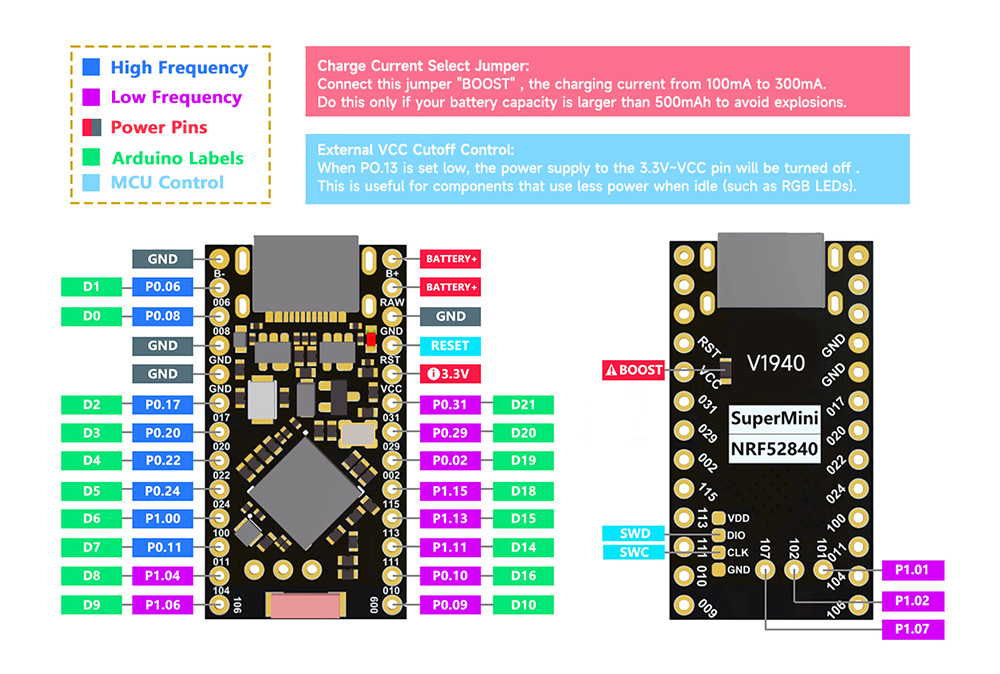

# zmk-config-promicro52840

ZMK keyboard configuration for the Promicro NRF52840 shield, that utilizes all available controller pins (incliding 3 additional in the middle of PCB, 21 pin in total!).

Tested with Promicro NRF52840 from Aliexpress. Should work with NiceNano! V2 as well.

Can be used for testind and as a config reference.

For testing you can just flash firmware from build folder, and one by one short each pin to the ground. Each shortening should produce letter from "a" to "u".

